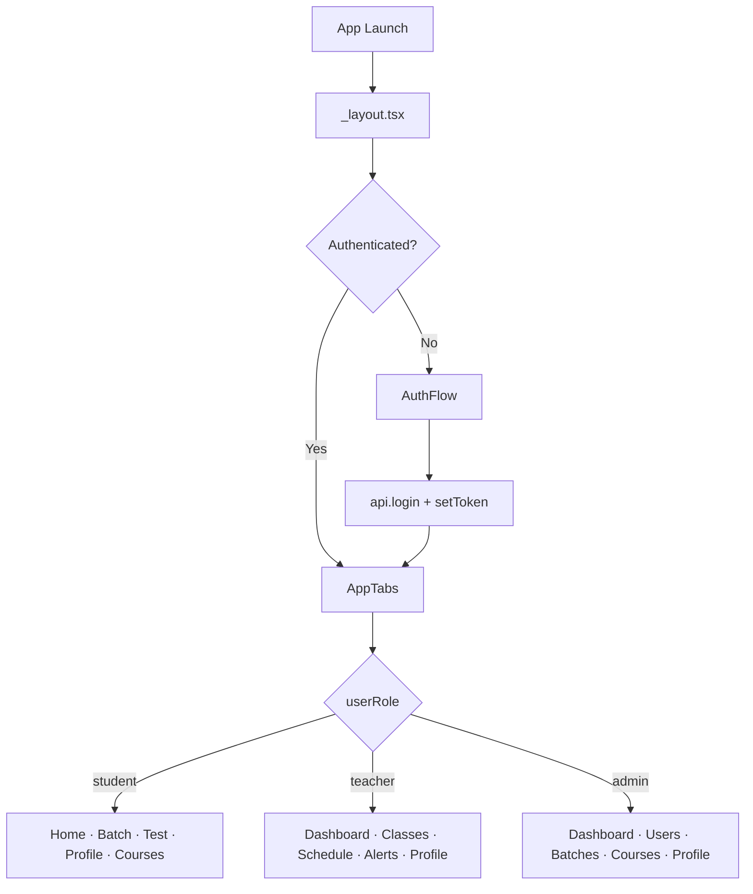

# Nexus LMS — Frontend

Cross-platform Learning Management System for **Corporate Training Center LLP**. Built with Expo and React Native, the app serves three roles — **Student**, **Teacher**, and **Admin** — from a single codebase on Android, iOS, and Web.

---

## What This App Does

Nexus is a multi-role LMS frontend that connects to a Spring Boot REST API (`localhost:8080`). Each role gets a tailored portal:

| Role | Portal | Primary Purpose |
|------|--------|-----------------|
| **Student** | Student Portal | Join live classes, view batches, take tests, browse courses |
| **Teacher** | Teacher Portal | Manage classes, schedule, alerts, upload recordings & study materials |
| **Admin** | Admin Console | Manage users, courses, batches, and handle student enquiries |

New visitors can submit an **enquiry form** (sign-up flow) without creating an account. Admins review enquiries from the dashboard.

---

## Tech Stack

| Layer | Technology |
|-------|------------|
| Framework | Expo SDK 54, React Native 0.81, React 19 |
| Language | TypeScript (strict) |
| Routing entry | Expo Router (`expo-router/entry`) |
| In-app navigation | Custom state-based tab system (`AppTabs`) |
| Styling | React Native `StyleSheet` + brand theme (`#7B2CBF` purple, `#FFB703` gold) |
| Storage | AsyncStorage (native) / localStorage (web) for JWT & profile photo |
| API | `fetch`-based REST client in `src/services/api.ts` |

**Platforms:** Android · iOS · Web (web uses a sidebar layout; mobile uses a floating bottom tab bar)

---

## Architecture Overview

The app does **not** use Expo Router for screen-to-screen navigation. Expo Router only provides the entry point; all real navigation is handled in React state.

```
App Launch
    └── src/app/_layout.tsx          ← Root: auth gate + theme
            ├── AuthFlow             ← Unauthenticated users
            │     LOGO → SPLASH → SIGN_IN / SIGN_UP (enquiry)
            └── AppTabs              ← Authenticated users (role-based tabs)
                  ├── Student screens
                  ├── Teacher screens
                  └── Admin screens
```



### Key files to know first

| File | Responsibility |
|------|----------------|
| `src/app/_layout.tsx` | Auth state, theme provider, chooses AuthFlow vs AppTabs |
| `src/screens/auth/auth-flow.tsx` | Login, enquiry form, role selection |
| `src/components/layout/app-tabs.tsx` | Role-based tab config and screen rendering |
| `src/services/api.ts` | All backend calls and JWT token management |

---

## Getting Started

### Prerequisites

- Node.js 18+
- npm
- [Expo CLI](https://docs.expo.dev/get-started/installation/) (via `npx expo`)
- Android Studio / Xcode (for native builds)
- **Backend API** running at `http://localhost:8080` (required for auth and admin features)

### Install & run

```bash
npm install
npx expo start
```

| Command | Description |
|---------|-------------|
| `npm start` | Start Expo dev server |
| `npm run android` | Run on Android emulator/device |
| `npm run ios` | Run on iOS simulator/device |
| `npm run web` | Run in browser |
| `npm run lint` | Run ESLint |

### Backend URL

Configured in `src/services/api.ts`:

- **iOS / Web:** `http://localhost:8080/api`
- **Android emulator:** `http://10.0.2.2:8080/api` (maps to host machine's localhost)

Update `BASE_URL` if your backend runs on a different host or port.

### Demo credentials

Shown in the login screen UI:

| Role | Email | Password |
|------|-------|----------|
| Student | `student@nexus.com` | `student123` |
| Teacher | `priya.sharma@nexus.com` | `teacher123` |
| Admin | `admin@nexus.com` | `admin123` |

---

## Project Structure

```
src/
├── app/                        # Expo Router entry (minimal — real nav is in AppTabs)
│   ├── _layout.tsx             # Root layout: auth gate
│   ├── index.tsx               # Re-exports HomeScreen (legacy route)
│   └── explore.tsx             # Expo template page (unused in main flow)
│
├── components/
│   ├── common/                 # Shared UI: ThemedText, AnimatedIcon, Collapsible, etc.
│   └── layout/
│       └── app-tabs.tsx        # Main navigator — start here for screen wiring
│
├── constants/
│   └── theme.ts                # Colors, spacing, fonts
│
├── hooks/
│   ├── use-theme.ts
│   └── use-color-scheme.ts
│
├── screens/
│   ├── admin/                  # Admin CRUD: users, courses, batches, dashboard
│   ├── auth/                   # Login + enquiry flow
│   ├── batches/                # Student batch views
│   ├── courses/                # Course list, explore, details
│   ├── home/                   # Student home + class recordings
│   ├── profile/                # Profile + settings (role-specific sub-views)
│   ├── teacher/                # Teacher portal screens
│   └── tests/                  # MCQ tests + active test runner
│
└── services/
    └── api.ts                  # Single API service — all backend integration
```

Path alias: `@/*` → `./src/*` (see `tsconfig.json`).

---

## Role-Based Features

### Student Portal

| Tab | Screen | Notes |
|-----|--------|-------|
| Home | `home-screen.tsx` | Live/upcoming classes, trending courses, recordings |
| Batch | `batches-screen.tsx` | Ongoing & upcoming batches |
| Test | `tests-screen.tsx` | MCQ tests and study materials |
| Profile | `profile-screen.tsx` | Notifications, privacy, help, account settings |
| Courses | `courses-screen.tsx` | Browse active courses from API |

Sub-navigation (state overlays): course details, explore courses, class recordings.

### Teacher Portal

| Tab | Screen | Notes |
|-----|--------|-------|
| Dashboard | `teacher-dashboard-screen.tsx` | Stats, quick actions |
| Classes | `teacher-classes-screen.tsx` | Active/upcoming/completed classes |
| Schedule | `teacher-schedule-screen.tsx` | Weekly timetable |
| Alerts | `teacher-alerts-screen.tsx` | Notifications & preferences |
| Profile | `profile-screen.tsx` | Account settings, help |

Overlay screens from dashboard: `upload-recording-screen.tsx`, `study-materials-screen.tsx`.

> `teacher-assessments-screen.tsx` exists but is **not wired** into `app-tabs.tsx` yet.

### Admin Console

| Tab | Screen | Notes |
|-----|--------|-------|
| Dashboard | `admin-dashboard-screen.tsx` | Stats + enquiry inbox |
| Users | `admin-users-screen.tsx` | Students & teachers CRUD |
| Batches | `admin-batches-screen.tsx` | Batch CRUD + student list per batch |
| Courses | `admin-courses-screen.tsx` | Course CRUD with enrollment counts |
| Profile | `profile-screen.tsx` | Admin-specific security & system settings |

---

## API Integration

All endpoints are defined in `src/services/api.ts`. The client attaches a `Bearer` JWT from memory or storage on every authenticated request.

### Auth & token flow

1. `api.login()` → response includes JWT
2. `setToken()` stores it in memory + AsyncStorage/localStorage
3. `loadToken()` runs on app mount (token loaded, but user must still sign in — see note below)
4. `clearToken()` on logout

### Endpoint summary

| Area | Methods |
|------|---------|
| Auth | `POST /auth/login` |
| Admin | `GET /admin/dashboard`, `GET /admin/profile`, student CRUD |
| Users | `POST /admin/users` (create student/teacher) |
| Teachers | Profile, list, CRUD, course assign/unassign |
| Courses | Public list, active list, CRUD |
| Batches | CRUD, `GET /batches/:id/students` |
| Enrollments | By course title, enrollment count |
| Enquiries | List (admin), submit (sign-up form) |

### What's connected vs mock

| Feature | Backend API | Mock / static data |
|---------|-------------|-------------------|
| Login & enquiries | ✅ | — |
| Admin users, courses, batches | ✅ | — |
| Course catalog (list) | ✅ | — |
| Course details (syllabus, teacher bio) | — | ✅ `coursesData` in `home-screen.tsx` |
| Student home, batches, tests | — | ✅ |
| Teacher stats, schedule, classes | — | ✅ |
| Recordings, study materials, uploads | — | ✅ (UI only) |

When extending the app, check whether a screen already calls `api.*` or uses hardcoded arrays before adding new endpoints.

---

## UI Patterns

- **Mobile:** Floating capsule bottom tab bar; hidden when a profile sub-view is open
- **Web:** Left sidebar (`#1E1B4B`) + main content panel
- **Admin screens:** Gradient headers, modal forms, paginated lists (`PAGE_SIZE = 5`), toast notifications
- **Profile sub-views:** Routed via `currentSubView` state in `ProfileScreen` (`profile` · `notifications` · `privacy` · `help` · `account`)

Brand colors: primary `#7B2CBF`, accent `#FFB703`, backgrounds `#F9FAFB` / `#F3F4F6`.

---

## Development Notes

1. **No global state library** — each screen uses local `useState` / `useEffect`. Auth state lives only in `_layout.tsx`.
2. **Session restore is incomplete** — JWT is persisted on login, but `_layout.tsx` does not auto-set `isAuthenticated` from a stored token. Users see the login screen on every cold start.
3. **Expo Router is underused** — `src/app/explore.tsx` is leftover Expo template code; the live app flow is `_layout.tsx` → `AppTabs`.
4. **Package name** — `package.json` and `app.json` still use `myfirstapp` / `MyFirstApp`; the product brand is Nexus.
5. **React Compiler** is enabled in `app.json` experiments.
6. **Native Android** project is prebuilt under `android/` for `expo run:android`.

---

## Common Tasks for New Developers

### Add a new screen to a role tab

1. Create the screen under `src/screens/<role>/`
2. Import it in `src/components/layout/app-tabs.tsx`
3. Add it to `getTabsConfig()` and `renderScreen()` for the target role

### Add a new API endpoint

1. Add the method to `api` object in `src/services/api.ts`
2. Call it from the relevant screen's `useEffect` or event handler

### Add a profile sub-view

1. Create screen under `src/screens/profile/`
2. Extend `ProfileSubView` type and routing in `profile-screen.tsx`
3. Wire navigation from profile menu items

---

## Scripts Reference

```bash
npm start          # Expo dev server
npm run android    # Native Android build
npm run ios        # Native iOS build
npm run web        # Web dev server
npm run lint       # ESLint
npm run reset-project  # Expo template reset (avoid unless starting fresh)
```

---

## License

See [LICENSE](./LICENSE).